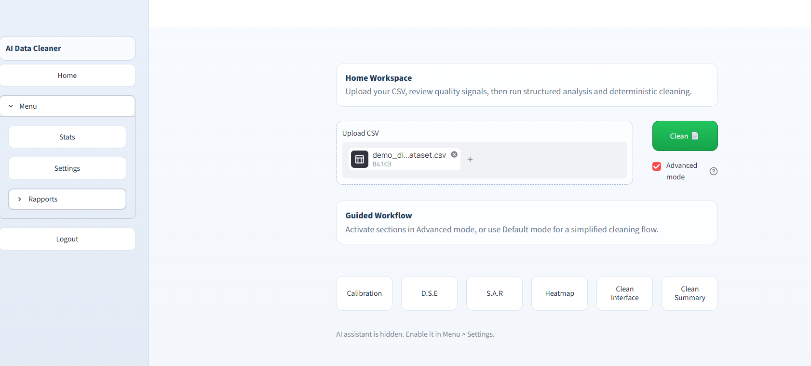
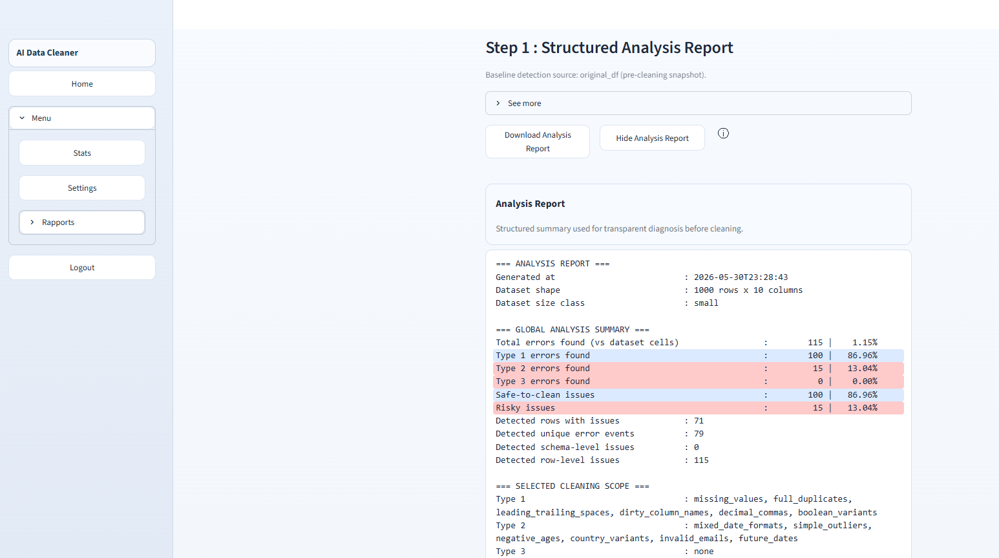
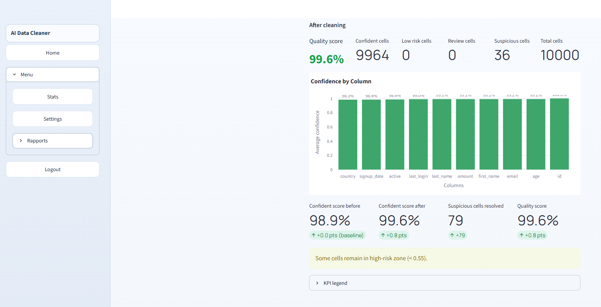

# AI Data Cleaner

> Streamlit application for safe, transparent, and deterministic cleaning of tabular datasets — powered by Azure OpenAI for analysis, pure Python for execution.

---

> **Status:** Active development — v0.11 shipped (16 parts completed), multi-source import/export in progress. Private MVP.

---

## What It Does

```
Dirty CSV / Excel
      │
      ▼
 ┌─────────────────────┐
 │    AI Analysis      │  ← Azure OpenAI identifies issues, classifies by type
 └─────────────────────┘
      │
      ▼
 ┌─────────────────────┐
 │   User Review       │  ← Heatmap, structured report, error taxonomy
 └─────────────────────┘
      │
      ▼
 ┌─────────────────────┐
 │  Deterministic      │  ← Python methods only — no AI execution on data
 │  Cleaning           │
 └─────────────────────┘
      │
      ▼
 Clean Dataset · Analysis Report · Cleaning Report · Calibration Report
```

The core design insight: **AI recommends, Python executes.**  
No language model ever modifies the data directly — every transformation is a deterministic, auditable function with a predictable outcome.

---

## Demo

[](https://youtu.be/ulGd27F5i1I)

▶ [Watch the full demo on YouTube](https://youtu.be/ulGd27F5i1I)

### Screenshots

**Upload & Dashboard**


**Error Detection & Analysis Report**


**Confidence Heatmap & Cleaning Summary**


> Three screenshots give the visual overview — the video covers the full workflow.

---

## Tech Stack

| Layer | Choice | Why |
|---|---|---|
| UI Framework | Streamlit | Data-native widgets, rapid MVP iteration |
| AI Analysis | Azure OpenAI (Responses API) | Enterprise-grade, structured output support |
| Data Manipulation | Pandas | Industry standard, reproducible transformations |
| Visualization | Custom heatmaps over tabular data | Confidence scoring overlaid cell-by-cell |
| Styling | Custom CSS with design tokens | Professional, sober enterprise UI |
| Configuration | `.env` + python-dotenv | Zero secrets in source code |

---

## Architecture & Design Principles

### 1. Dataset Safety as a Hard Constraint

The original uploaded dataset is **never modified**. All cleaning operations occur on an isolated working copy. This is enforced at every layer of the application — the user can always compare the original vs. cleaned state side by side, and the original is available for re-export at any point.

### 2. AI Analyzes, Python Cleans

Azure OpenAI is used exclusively for **analysis and recommendations**. The actual data transformations are executed by deterministic Python functions — meaning the same input always produces the same output, with no model variability or hallucination risk on the data itself.

This boundary is intentional: it combines the intelligence of a large language model with the predictability of classical code.

### 3. Structured Error Taxonomy (Type 1 / 2 / 3)

Errors are classified into three difficulty tiers that drive the cleaning strategy:

| Type | Profile | Cleaning Approach |
|---|---|---|
| **Type 1** | Simple, high-confidence | Typically auto-cleanable (e.g., whitespace, boolean variants) |
| **Type 2** | Context-dependent | Requires user configuration before execution (e.g., date formats, outliers) |
| **Type 3** | Complex or ambiguous | Flagged for human review (e.g., partial duplicates, multi-column inconsistencies) |

This taxonomy makes the cleaning pipeline **explainable** — every action maps to a known category with a documented rationale.

### 4. Calibration System

The application supports a calibration mode: a "ground truth" specification is loaded alongside the dataset. After analysis and cleaning, the app compares its results against the known truth — delivering **quantitative, measurable evaluation** of cleaning quality rather than subjective assessment.

This is what separates a data cleaning tool from a data cleaning *measurement* tool.

### 5. Cell-Level Confidence Scoring

Every cell in the dataset receives a confidence score based on the errors detected in its column and row context. An interactive heatmap visualizes this before and after cleaning, with clear threshold bands:

- **Confident** (>95%) — no action needed
- **Low risk** (85–95%) — acceptable, monitor
- **Review required** (55–85%) — flag for attention
- **Suspicious** (≤55%) — likely error

---

## Feature Set (v0.11)

**Core**
- [x] Session-based login
- [x] CSV upload with dataset safety enforcement
- [x] Structured analysis report export (`.txt`)
- [x] Cleaning report export (`.txt`)
- [x] Cleaned dataset export (`.csv`)
- [x] Calibration report (when calibration mode enabled)

**Error Detection & Analysis**
- [x] Type 1 / 2 / 3 error detection
- [x] Cell-level confidence scoring
- [x] Before/after confidence heatmaps
- [x] Quality score KPIs with before/after delta

**Cleaning**
- [x] Deterministic cleaning methods per error type
- [x] Default mode (safe presets) and Advanced mode (full control)
- [x] Granular scope selection by error type

**AI Features**
- [x] AI-powered dataset analysis with structured recommendations
- [x] AI Data Assistant — conversational, dataset-aware
- [x] Slash command interface for guided AI interactions

**UX & Workflow**
- [x] 6-step guided workflow interface
- [x] Default / Advanced mode split
- [x] Calibration history persistence (local log)

---

## Security & Data Safety

- All credentials and API keys stored in `.env` — never in source code
- Original dataset immutable throughout the entire session
- AI assistant operates in read-only mode relative to the dataset
- No user data stored server-side; session is local
- No data sent to external services beyond scoped AI analysis calls

---

## Roadmap

### v0.12 — Multi-Source Import/Export *(in progress)*
- Excel multi-sheet support
- Google Sheets connector
- Export to multiple formats

### v0.13 — Planned
- Enhanced calibration tooling and comparison reporting
- Extended Type 3 detection coverage
- Reporting improvements and custom templates

---

## What This Demonstrates

| Skill | Demonstrated by |
|---|---|
| AI integration (Azure OpenAI) | Analysis pipeline, AI assistant architecture |
| Data engineering | Pandas cleaning pipeline, error taxonomy |
| Security discipline | `.env` management, immutable dataset pattern |
| Product thinking | Calibration system, error taxonomy design, Default/Advanced UX |
| UI/UX | Streamlit custom theme, guided 6-step workflow |
| Software architecture | Module separation, deterministic execution boundary |
| Agile methodology | Part-by-part roadmap with explicit approval gates, bug tracking |

---

*Built with Streamlit, Azure OpenAI, and Python. Developed with AI-assisted methodology (Claude Code).*
